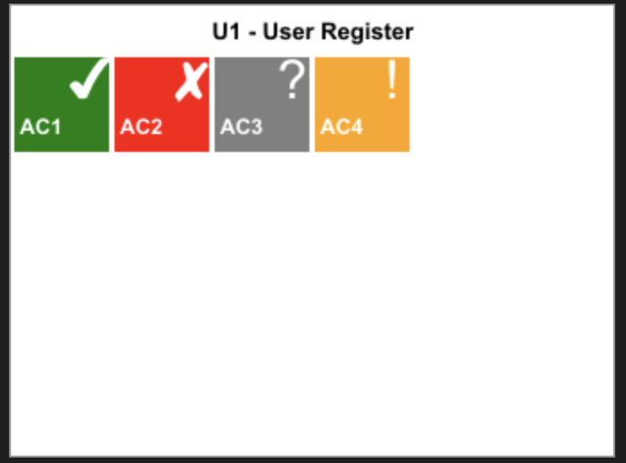

# Manual Testing Site

This project is intended as a tool to help organize manual tests and importantly allow easy visualisation of the test results through an image based API

## Components
The project is composed of two subprojects:
- A React web application that acts as the interface for managing tests
  - This can be found in `web-app`
- An Express REST API that handles the implements the required API spec to provide functionality for the web interface and image apis
  - This can be found in `api`

## Image generation
An example of the current image generation is shown below. This shows the current status of all tests within  a story.
A similar end point should exist for stories within a project. Other improvements and customisations will be added in the future.

